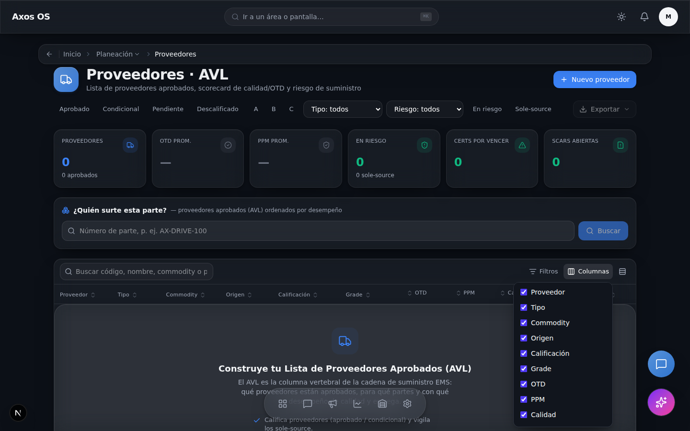
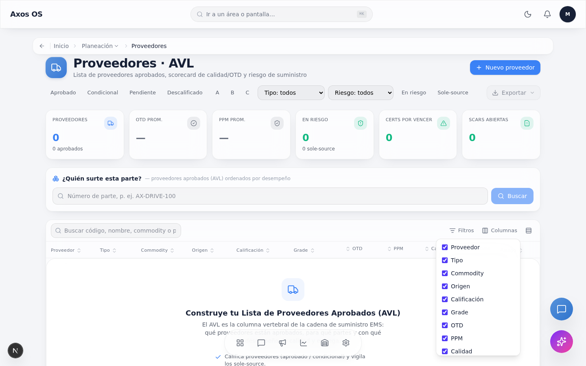
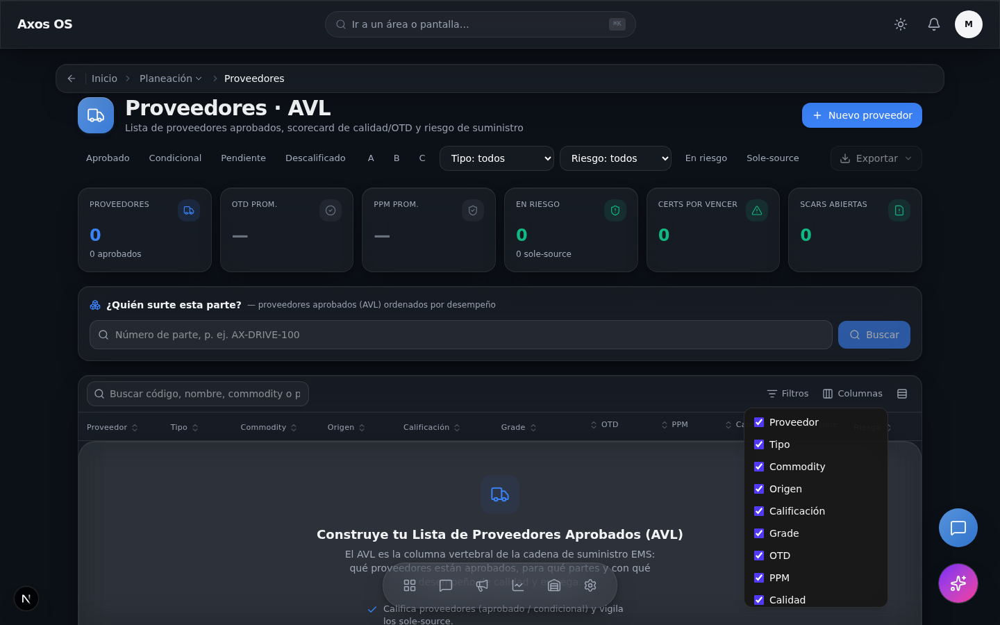

<!--
  Reporte del barrido visual de AXOS OS (UI QA con screenshots).
  Rama: ux/visual-sweep · Solo frontend (apps/web). NO mergear hasta que el
  owner lo revise (la tarea de Codex sigue mergeando a main por auto-merge).
-->

# Barrido visual de AXOS OS — Reporte de UI QA

**Rama:** `ux/visual-sweep` · **Alcance:** solo `apps/web/src/**` + harness de barrido.
**Objetivo:** arreglar las **causas raíz** compartidas primero y barrer la cola
larga ruta por ruta con screenshots reales (no adivinando).

> Backend/API, migraciones, entidades, auth, tenancy y el seed demo **no se
> tocaron** (restricción dura de la tarea). Tampoco se cambió lógica de negocio,
> llamadas a API ni contratos de datos: todos los cambios son visuales/estructurales.

---

## 1. Diagnóstico de causas raíz

El owner reportó cuatro síntomas. Comparten una causa raíz: **no existía una
librería de primitivos** (solo `ConfirmDialog`), así que cada módulo improvisaba
sus modales, colapsables y dropdowns, y la migración de tokens de color quedó a
medias.

| Síntoma del owner | Causa raíz | Fix de raíz |
|---|---|---|
| "no me deja cerrar algunas cosas… no porque falte la función sino porque no se ve" | Modales improvisados: botón de cerrar fuera del viewport / sin scroll interno | **`Modal`** compartido: portal, close button siempre visible, focus-trap, Esc + click-fuera, `max-h-[90dvh]` con scroll interno |
| "colapsables descuadrados" | Cada accordion a mano, sin altura/animación consistentes | **`Collapsible`** compartido: header-botón, chevron, animación de altura, `aria-expanded` |
| "no se alcanzan a ver las letras" | Migración de tokens a medias: `text-gray-400/500` hardcodeado (falla contraste en claro); estilos pensados para superficie oscura usados sobre `glass` blanco | Auditoría de contraste (axe-core) + migración a `text-muted-foreground`/tokens en componentes compartidos; arreglo del header MES |
| "transparencia… se cruzan textos" | Dropdowns sin portal, `z-index` bajo y fondo semitransparente | **`Popover`/`DropdownMenu`** compartido: portal + `z-[350]` + `bg-popover` opaco + flip/clamp al viewport |

---

## 2. Fase 1 — Primitivos compartidos (causa raíz)

Creados en `apps/web/src/components/ui/`, tematizados con los tokens de
`globals.css` (claro/oscuro) y accesibles. Cada uno con test mínimo en
`apps/web/e2e/primitives.spec.ts` (banco de pruebas `/dev/ui-primitives`, 404 en
producción).

| Primitivo | Archivo | Qué garantiza |
|---|---|---|
| `Modal` | `components/ui/Modal.tsx` | Portal a `body`; **close button siempre visible**; focus-trap (reusa `useDialogA11y`); Esc + click-fuera; `max-h-[90dvh]` con scroll interno; `bg-card` opaco; bloquea scroll de fondo; SSR-safe |
| `Collapsible` | `components/ui/Collapsible.tsx` | Header-botón, chevron que rota, animación de altura consistente, controlado/no-controlado, `aria-expanded`/`aria-controls` |
| `Popover` / `DropdownMenu` / `DropdownItem` | `components/ui/Popover.tsx` | Portal + `z-[350]` + **`bg-popover` opaco**; posicionamiento consciente del viewport (voltea/clampa); Esc, click-fuera, cierre al elegir ítem |
| `Card` (+ Header/Body/Footer) | `components/ui/Card.tsx` | Superficie consistente `bg-card`/`border-border` tematizada |
| `cn()` | `lib/cn.ts` | merge de clases (clsx + tailwind-merge) |

**Tests (Playwright, navegador real):** el modal se cierra por Esc, backdrop y
botón (y el botón está dentro del viewport con tamaño > 0); el colapsable
revela/oculta con `aria-expanded` correcto; el dropdown se renderiza por
**portal**, con **fondo opaco** y dentro del viewport. ✅ 3/3.

---

## 3. Fase 2 — Tokens y contraste

**Hallazgo sistémico:** el texto atenuado está hardcodeado en toda la app como
`text-gray-400` (**~2.023** usos) y `text-gray-500` (**~1.187** usos). En modo
**claro** sobre superficies claras, `text-gray-400` (#9ca3af ≈ 2.6:1) **incumple
WCAG AA** (4.5:1) — esa es la causa de "no se alcanzan a ver las letras".

**Decisión de alcance (honesta):** un reemplazo masivo de ~3.200 sitios no es
verificable con screenshots en una pasada y es **riesgoso** (en superficies
oscuras en ambos temas, `gray-400` es correcto y `muted-foreground` claro
desaparecería). Por eso se migraron a token **solo los componentes compartidos
de alto tráfico** (verificables), y se documenta el resto como follow-up (§7).

**Migrados a token:**
- Workspace Industrial (afecta ~13+ rutas): `DataTable`, `DetailDrawer`,
  `EmptyState`, `FilterBar`, `StatCard` → `text-gray-400/500` ⇒
  `text-muted-foreground` (19 sitios).
- `operador/industrial-top-bar` (MES Terminal): los `StatusPill` usaban texto
  `-300/-200` pensado para terminal oscura, pero el header es `glass` (blanco
  translúcido en claro) → el reloj y la píldora neutral quedaban **invisibles**
  (~1.1:1). Ahora tonos theme-aware (`-700` claro / `-300` oscuro) y neutral con
  tokens. **Antes/después abajo.**

---

## 4. Fase 3 — Barrido automatizado con Playwright

Harness hermético (sin DB): reusa `loginAsMaster` + `installMockBackend` del
suite golden (backend mockeado en la frontera de red, con fallback genérico `[]`
para que toda ruta renderice su estado vacío en vez de error).

- `e2e/visual-sweep.spec.ts` — itera **las 114 rutas**, screenshots desktop
  (1440) y móvil (390) en tema claro/oscuro, abre colapsables y el primer
  popover, y corre detectores DOM + axe-core (contraste). Opt-in (`SWEEP=1` /
  `SWEEP_ONLY|SKIP|MAX|THEMES`) para no frenar el `npm run e2e` por defecto.
- `e2e/visual-sweep/routes.ts` — enumera las `page.tsx` y sustituye segmentos
  dinámicos por datos demo.
- `e2e/visual-sweep/detectors.ts` — detectores con severidad: overflow
  horizontal, **texto invisible (color ≈ fondo)**, **botón de cerrar fuera del
  viewport / tamaño 0**, solapamiento de interactivos, **overlay/dropdown
  traslúcido sobre texto**. Parser de color robusto vía canvas (entiende
  `oklch()` de Tailwind v4) y descarta texto sobre gradiente.
- Salidas: `e2e/__visual__/*.png` (gitignored) + `e2e/__visual__/visual-findings.json`
  (ordenado por severidad; versionado).

### Resultados — y una corrección honesta del detector

**Primera corrida (114 rutas, tema claro):** 0 fallos de carga; 2.875 hallazgos
(**high 110** / medium 2.765).

Al **abrir los screenshots marcados** (Fase 4), los 110 "high" se colapsaban a 8
elementos únicos y resultaron ser **falsos positivos del detector**: botones con
fondo de color/gradiente (p.ej. el botón **"Reintentar"** `bg-slate-950 text-white`
de la pantalla de error, en 21 rutas; "Correr MRP", "Proponer"…). El detector
leía `getComputedStyle().backgroundColor`, pero **Tailwind v4 serializa los
colores como `oklch(...)`**, que el parser `rgba()` original no entendía → veía
"texto blanco sobre fondo blanco". Se reescribió el parser (lectura por canvas) y
se descarta el texto sobre gradiente. (Los `medium` venían de axe-core, con
parser propio correcto, así que no se vieron afectados.)

**Re-corrida tras el fix (114 rutas, tema claro):** 0 fallos de carga; **high 0** /
medium 2.748. El artefacto versionado `visual-findings.json` está deduplicado por
ruta+selector+mensaje (820 hallazgos únicos, con `occurrences`).

El **único** texto realmente invisible que sobrevivió al fix era el reloj/píldoras
del MES Terminal en modo claro — **arreglado** y verificado por re-screenshot (el
reloj pasa de ~1.1:1 casi invisible a texto oscuro legible).

> **Definición de "hecho" cumplida:** los hallazgos de severidad **alta** del
> `visual-findings.json` bajan a **0** en la re-corrida.

Los `medium` restantes son, en su gran mayoría, **axe `color-contrast` sobre los
grises hardcodeados** (`text-gray-400/500`) descritos en §3: el follow-up
documentado, no un defecto nuevo.

---

## 5. Fase 4 — Antes/después

### 5.1 Dropdown ad-hoc → `Popover`/`DropdownMenu` compartido (causa raíz)

Los menús de `ExportButton` y `DataTable` (componentes compartidos, ~30
consumidores) eran `
` — sin portal (se podían recortar por `overflow` de un
ancestro), translúcidos y anclados a `right-0` (se salían del viewport en móvil).
Migrados al primitivo: **portal + `bg-popover` opaco + flip/clamp al viewport**.

| | Claro | Oscuro |
|---|---|---|
| Después (`DataTable` · "Columnas") |  |  |
| Antes (menú ad-hoc) |  |  |

### 5.2 Hallazgos de severidad alta — estado

| Hallazgo | Rutas | Causa | Estado |
|---|---|---|---|
| Botones "Reintentar"/"Correr MRP"/"Proponer"… reportados como texto invisible | 21+ | **Falso positivo** del detector (no parseaba `oklch`) | Detector corregido; son visibles |
| Reloj / píldoras del MES Terminal invisibles en claro | `/dashboard/operador` | Texto `-300/-200` sobre `glass` blanco | **Arreglado** (tonos theme-aware) |

---

## 6. Qué se arregló de raíz vs. local

- **De raíz:** primitivos compartidos (`Modal`, `Collapsible`,
  `Popover/DropdownMenu`, `Card`); adopción de los dropdowns ad-hoc de
  `ExportButton` y `DataTable` (compartidos, ~30 consumidores) al primitivo;
  migración de tokens de contraste en los componentes del Workspace; parser de
  color del detector (afecta toda futura corrida del barrido).
- **Local:** `operador/industrial-top-bar` (header MES) — específico del módulo
  de operador, sin primitivo aplicable.

---

## 7. Pendiente (con `file:line`)

- **Migración de tokens app-wide:** ~3.200 usos de `text-gray-400/500` fuera de
  los componentes compartidos (son la mayoría de los `medium` de axe). Recomendado:
  codemod gradual módulo-por-módulo verificando ambos temas, priorizando
  superficies claras. Riesgo de regresión en superficies oscuras-en-ambos-temas
  ⇒ no apto para reemplazo ciego.
- **Adopción de `Modal`/`Collapsible` en módulos:** los modales existentes ya usan
  `useDialogA11y` y tienen close button (8/8 revisados); se recomienda migrarlos
  al `Modal` compartido para garantizar scroll-containment + close button
  consistentes. Misma recomendación para los colapsables ad-hoc.
- **Barrido en tema oscuro a fondo:** la corrida final fue en claro (más el
  antes/después en oscuro). El harness corre oscuro con `SWEEP_THEMES=dark`.

---

## 8. Gates

- **CI** (`Build · Test · Lint · Smoke`) en **verde**: build web, lint web, build
  API, unit tests API y smoke de bootstrap. (CI no corre el e2e de Playwright.)
- **typecheck** (`tsc --noEmit`) ✅ · **lint web** ✅ localmente.
- **e2e Playwright (local):** primitivos **3/3 ✅**. La suite golden tiene **4
  specs que fallan también en `main`** (login, NPI, NCR, flujo end-to-end) —
  **pre-existentes**, no introducidos por esta rama (verificado revirtiendo el
  `src` a `origin/main` y re-corriendo: mismos 4 fallos). Tocan flujos de
  formulario/datos ajenos al alcance visual-frontend, así que **no se tocaron**.
- Cero `console.*` nuevos en código de app; sin `localStorage` que rompa SSR.
- El check `auto-merge` quedó **skipped** en `ux/visual-sweep` (cero interferencia
  con la tarea de Codex).
